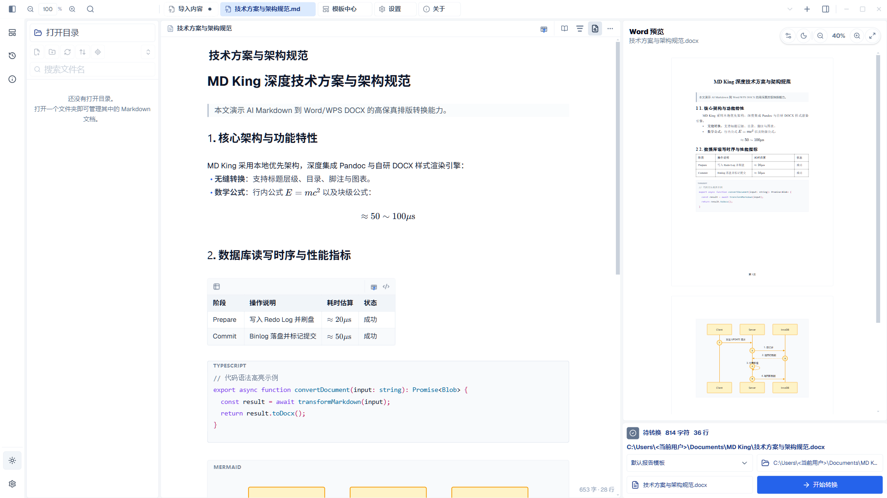
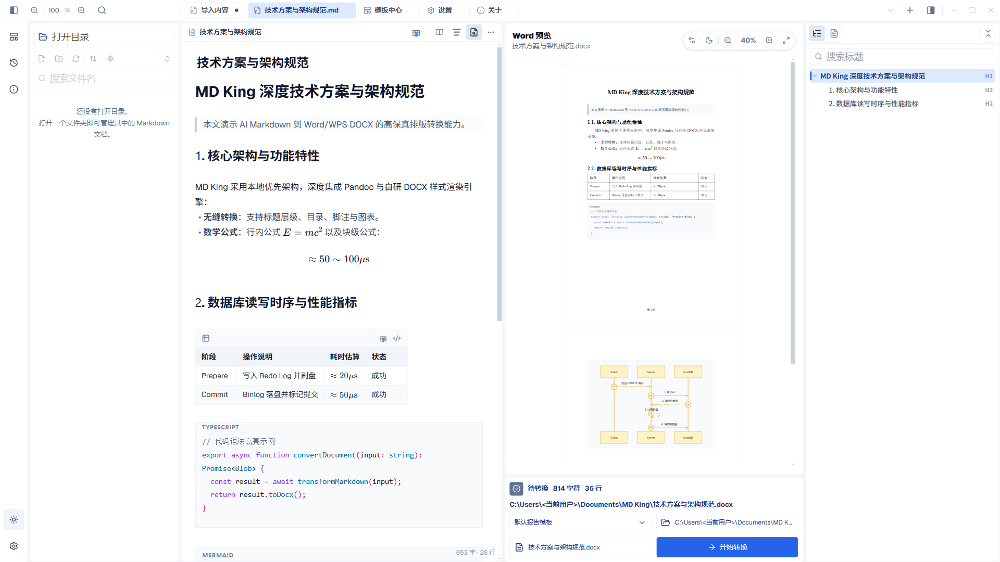
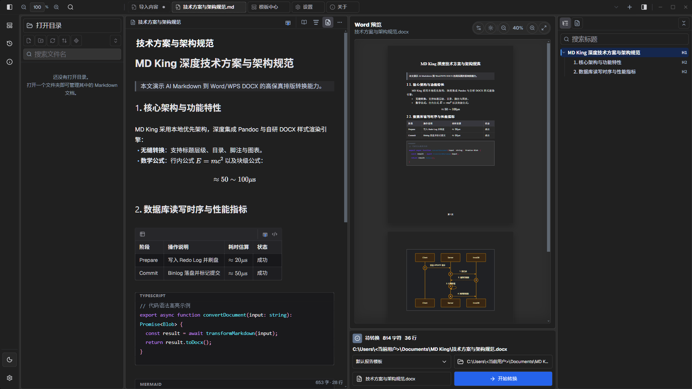
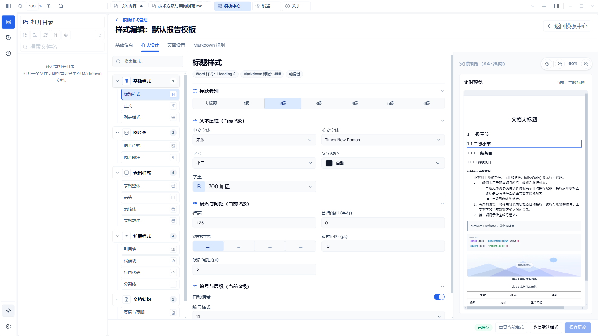
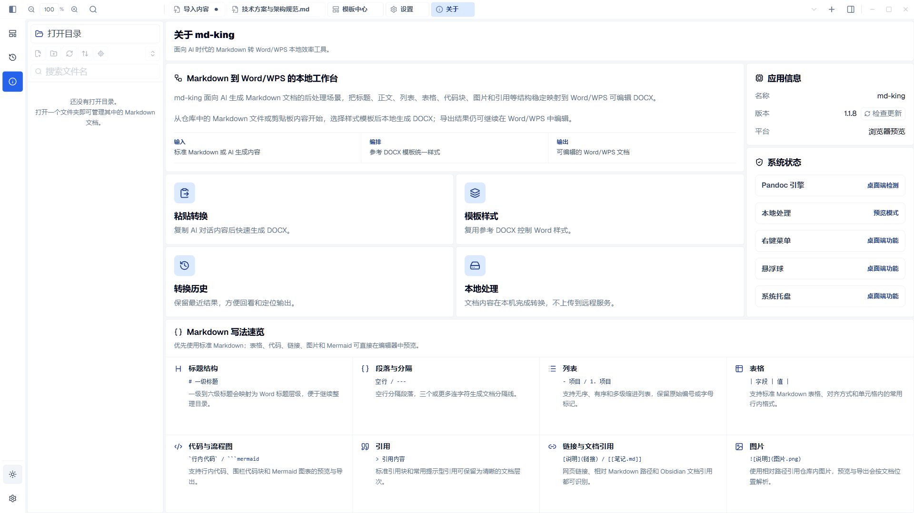

<div align="center">


# MD King (文档之王)

**面向 AI 时代的一站式 Markdown 转 Word/WPS 本地桌面排版利器**

[](https://github.com/GuoWWWX/md-king/releases)
[](https://github.com/GuoWWWX/md-king)
[](https://tauri.app)
[](https://react.dev)
[](https://www.rust-lang.org)
[](LICENSE)

<p align="center">
  <a href="#-软件截图与核心功能展示">核心功能展示</a> •
  <a href="#-核心亮点特性">亮点特性</a> •
  <a href="#-下载与安装">安装下载</a> •
  <a href="#-应用内自动更新">自动更新</a> •
  <a href="#-开发与代码分支">开发贡献</a>
</p>

</div>

---

## 💡 为什么需要 MD King？

如今越来越多的工作者与开发者借助 **ChatGPT、Claude、DeepSeek、Kimi** 等大模型辅助生成研究报告、技术方案、公文材料或学术草稿。

AI 默认输出极佳的结构化 Markdown；但一旦直接**复制粘贴到 Word / WPS** 时，格式往往瞬间崩溃：
- ❌ **标题层级混乱**：标题 1 / 标题 2 样式失真，多级编号与目录无法自动识别；
- ❌ **数学公式乱码**：LaTeX 公式变成纯文本代码或格式错位；
- ❌ **时序图/流程图无法渲染**：Mermaid 语法直接变为原始代码块；
- ❌ **代码块与表格变形**：代码块无语法高亮与行号，表格单元格跨行断裂、宽窄不一；
- ❌ **重复调格式耗时耗力**：每次生成新文档都要耗费半小时手动调整页边距、字体、段落行距与题注。

> **MD King 为终结这一痛点而生！**  
> 无需联网上传、保护隐私安全；本地一键将 Markdown 结构化转换成样式规范、排版优美、支持继续编辑的 Word/WPS `DOCX` 办公文档。

---

## 📸 软件截图与核心功能展示

### 1. 沉浸式 Markdown 双栏工作台
所见即所得的极客工作台：实时渲染 Markdown、高亮代码块、KaTeX 数学公式与 Mermaid 专业图表，右侧并列展现高保真 Word/WPS DOCX 纸张排版双页视图。



---

### 2. 侧边大纲目录导航
支持智能解析多级标题层级，一键展开右侧文档侧栏，快速搜索与高亮定位长篇文档结构。



---

### 3. 极客深色模式与智能图表自适应
全面支持系统级深色/浅色模式无缝自适应切换。Mermaid 时序图自适应微光暗调背景与节点文字对比度反转，夜间写作沉浸舒适。



---

### 4. 专业级 Word / WPS 样式编辑设计器
细粒度掌控全篇排版细节：标题级别（1~6 级）、正文字体（宋体/Times New Roman 等）、中英文混排、字号字重、行距行高、首行缩进、段前段后间距及多级自动编号。



---

### 5. 强大的样式模板中心
内置官方公文规范、技术方案、学术论文等多套工业级预设模板，支持自定义模板导入与分组管理，一键换装应用。


---

### 6. 真实 DOCX 导出排版效果
告别手动调格式！标题自动编号、表格智能分栏、图表高清矢量光栅化与自动题注居中，开箱即达出版级排版水准。


---

### 7. 深度个性化设置与引擎维护
提供输出目录自定义、Pandoc 内核版本检测与维护、主题配色定制及全局快捷操作配置。


---

### 8. 关于面板与应用内一键自动推送更新
集成客户端版本自检、Markdown 语法速览与应用内自动静默升级，时刻保持最新生产力体验。



---

## 🔥 核心亮点特性

- [x] **本地优先 (Local First)**：所有转换与文档处理均在本机完成，隐私数据绝不上传云端，无网络亦可流畅使用。
- [x] **完整语法生态支持**：
  - **公式支持**：深度集成 KaTeX，完美支持行内公式 `$...$` 与独立块级公式 `$$...$$`；
  - **图表渲染**：支持 Mermaid 流程图、时序图（带深色自适应与微光暗调背景）、类图、状态图；
  - **富文本元素**：Callout 提示框、任务清单、自定义题注、表格列宽自适应。
- [x] **Word 模板复用机制**：基于先进的样式映射引擎，可自由绑定公司/学术 Word 模版，保留原有字体、边距与标题层级。
- [x] **极速悬浮转换**：支持右键菜单关联、全局快捷键 (`Ctrl+Alt+V`)、桌面快捷悬浮小球。
- [x] **应用内自动推送更新**：无需手动去网页翻找安装包，客户端左侧栏自动提示新版本，点击即弹出进度条一键静默升级。

---

## 📥 下载与安装

进入 [GitHub Releases 页面](https://github.com/GuoWWWX/md-king/releases) 即可下载最新 Windows 桌面端安装程序：

| 版本 | 文件类型 | 适用系统 | 下载说明 |
| :--- | :--- | :--- | :--- |
| **最新正式版** | `md-king_x.x.x_x64-setup.exe` | Windows 10 / 11 (64-bit) | 双击运行安装即可，内置全套排版引擎 |

---

## 🔄 应用内自动更新

MD King 客户端内置了顺滑的**自动版本推送与无缝更新体系**：
1. **自动推送**：启动后应用会自动检测远端是否有新版本；当有新版本时，**软件左侧栏下半部分**会亮起炫酷的更新提醒按钮；
2. **更新进度弹窗**：点击该提醒按钮即可唤出更新面板，清晰查阅本次更新的 Release 日志与修复详情；
3. **一键下载并静默升级**：点击“立即更新”，软件将实时展示下载进度条与瞬时网速；下载完成后自动安全启动安装程序并覆盖升级！

---

## 🛠️ 开发与代码分支规范

本项目采用清晰的双分支研发规范，欢迎提交 Issue 与 Pull Request：

- **`main` 分支**：主分支，保持稳定可发布状态，每一次发版均打有对应版本的 Git Tag（如 `v1.1.8`）；
- **`develop` 分支**：开发分支，承载日常功能开发与特性合流，新功能提 PR 请合并至此分支。

### 本地启动与构建

```bash
# 1. 克隆仓库
git clone https://github.com/GuoWWWX/md-king.git
cd md-king

# 2. 安装前端依赖
pnpm install

# 3. 运行前端开发模式
pnpm dev

# 4. 启动 Tauri 桌面端调试
pnpm tauri dev

# 5. 打包生产安装包
pnpm tauri:build
```

---

## 📄 开源许可证

本项目基于 [MIT License](LICENSE) 开源。欢迎 Star 🌟 与 Fork 贡献！
