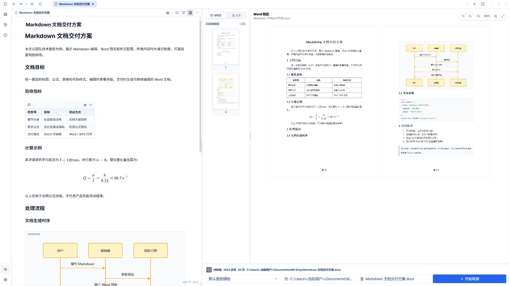
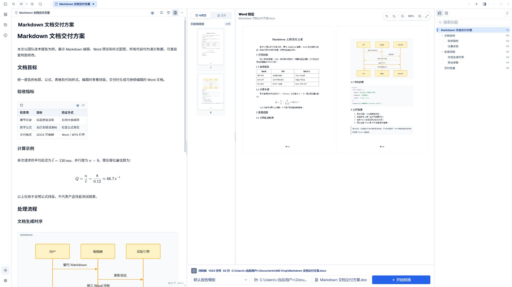
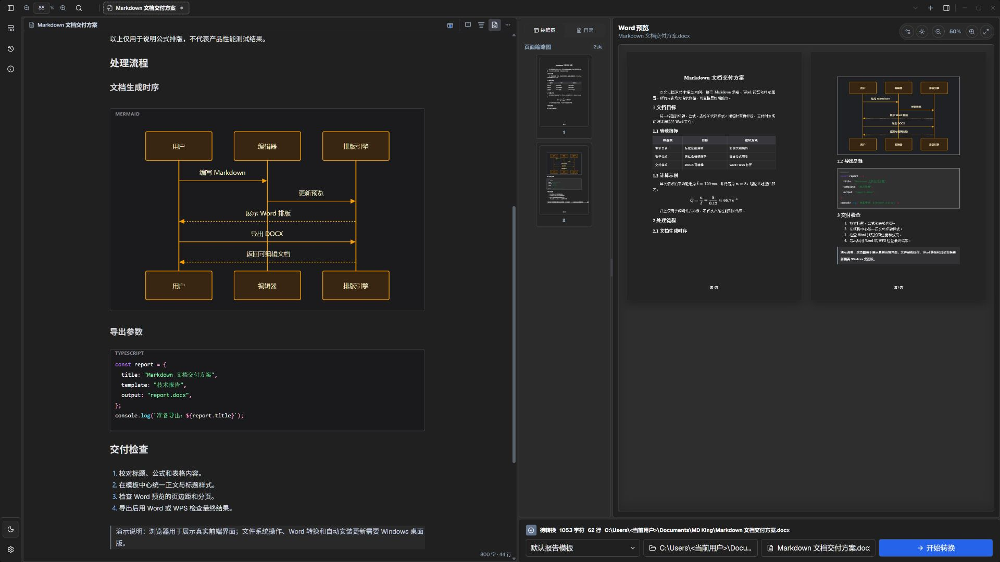
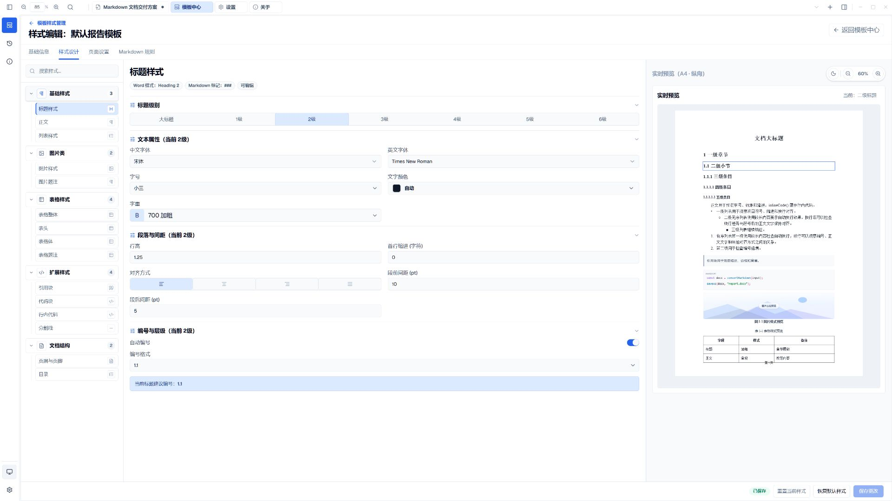
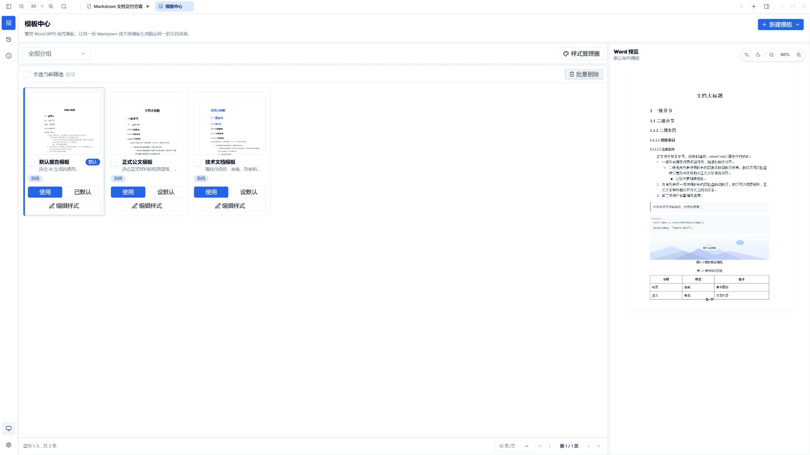
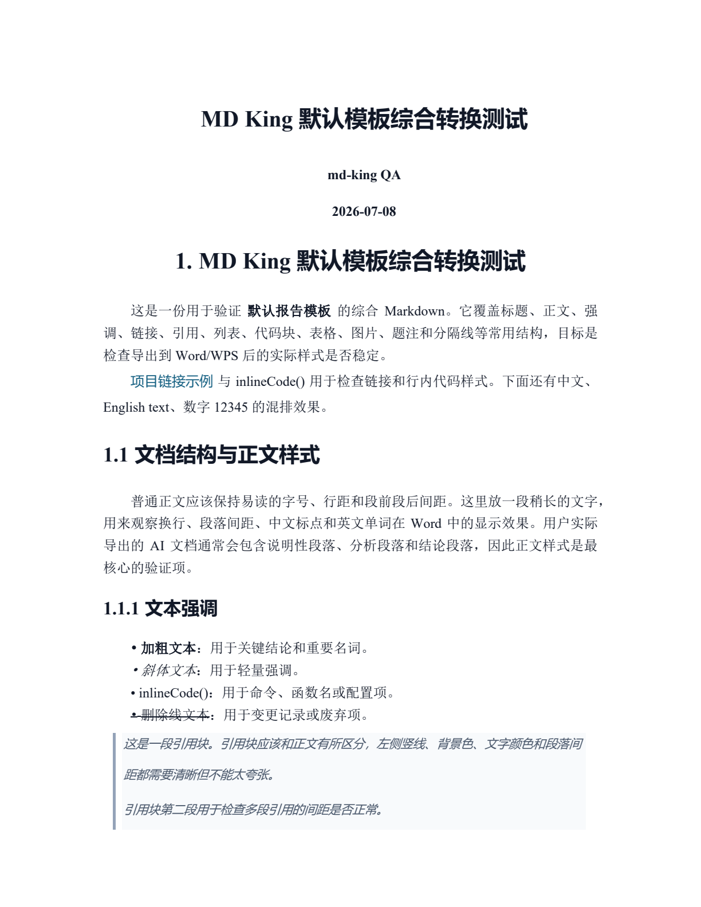
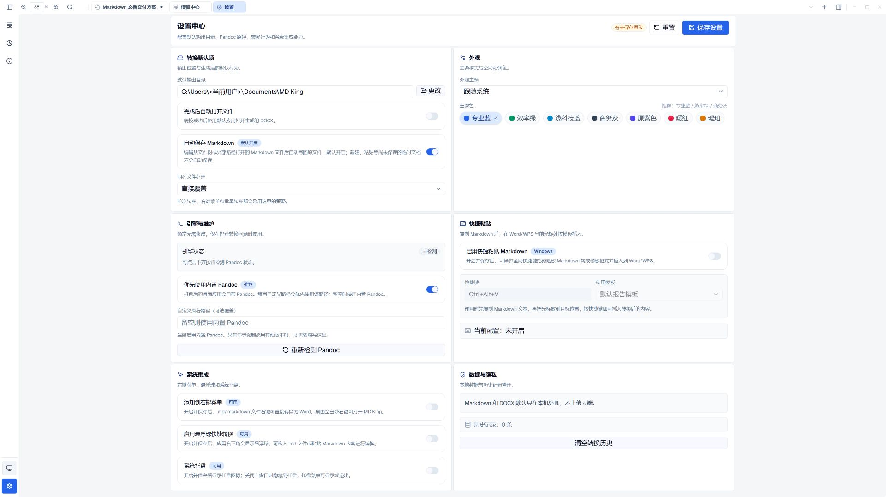
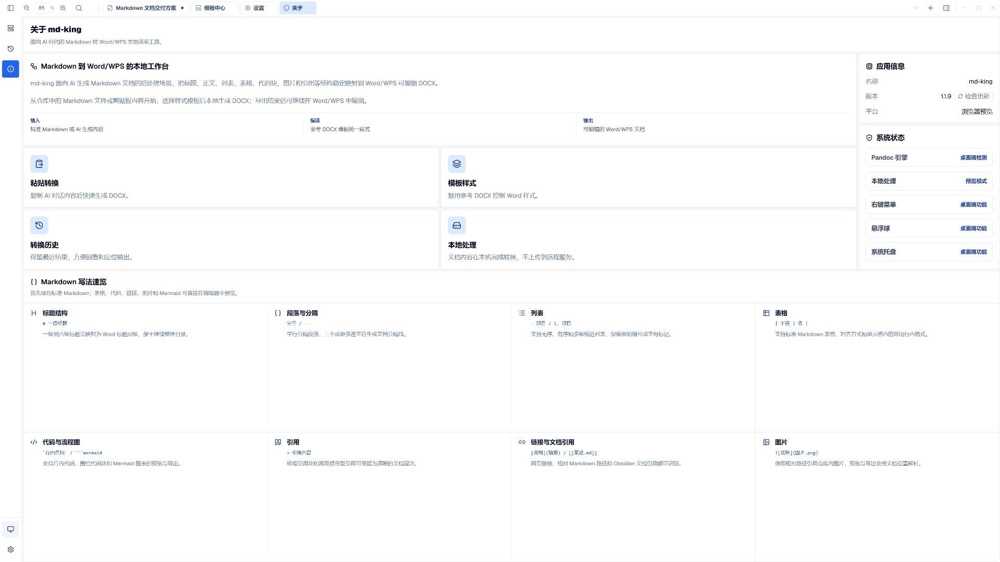

<div align="center">


# MD King (文档之王)

**面向 AI 时代的一站式 Markdown 转 Word/WPS 本地桌面排版利器**

[](https://github.com/GuoWWWX/md-king/releases)
[](https://github.com/GuoWWWX/md-king)
[](https://tauri.app)
[](https://react.dev)
[](https://www.rust-lang.org)
[](LICENSE)

<p align="center">
  <a href="#-软件截图与核心功能展示">核心功能展示</a> •
  <a href="#-核心亮点特性">亮点特性</a> •
  <a href="#-下载与安装">安装下载</a> •
  <a href="#-应用内自动更新">自动更新</a> •
  <a href="#-开发与代码分支">开发贡献</a>
</p>

</div>

---

## 💡 为什么需要 MD King？

如今越来越多的工作者与开发者借助 **ChatGPT、Claude、DeepSeek、Kimi** 等大模型辅助生成研究报告、技术方案、公文材料或学术草稿。

AI 默认输出极佳的结构化 Markdown；但一旦直接**复制粘贴到 Word / WPS** 时，格式往往瞬间崩溃：
- ❌ **标题层级混乱**：标题 1 / 标题 2 样式失真，多级编号与目录无法自动识别；
- ❌ **数学公式乱码**：LaTeX 公式变成纯文本代码或格式错位；
- ❌ **时序图/流程图无法渲染**：Mermaid 语法直接变为原始代码块；
- ❌ **代码块与表格变形**：代码块无语法高亮与行号，表格单元格跨行断裂、宽窄不一；
- ❌ **重复调格式耗时耗力**：每次生成新文档都要耗费半小时手动调整页边距、字体、段落行距与题注。

> **MD King 为终结这一痛点而生！**  
> 无需联网上传、保护隐私安全；本地一键将 Markdown 结构化转换成样式规范、排版优美、支持继续编辑的 Word/WPS `DOCX` 办公文档。

---

## 📸 软件截图与核心功能展示

以下七张应用界面图均为 **v1.1.9 前端生产构建在浏览器中实际运行的 1920 × 1080 截图**，使用[技术报告示例](docs/examples/technical-report.md)展示表格、公式、时序图与代码；没有使用概念图。首图的文件树来自软件自带的浏览器示例仓库。浏览器只用于前端展示，文件系统操作、Pandoc 转换、系统集成和自动安装更新需要 Windows 桌面版。DOCX 导出图是文档页面，保留原始纸张比例。

### 1. 文件树、Markdown 与大纲工作台
左侧展开文件树，中间编辑 Markdown 文档并实时渲染表格与数学公式，右侧显示多级标题大纲，便于管理文件和定位章节。首图隐藏 Word 预览，集中展示日常写作布局；需要检查导出排版时，可通过工具栏打开 Word/WPS 纸张预览。



---

### 2. 侧边大纲目录导航
支持智能解析多级标题层级，一键展开右侧文档侧栏，快速搜索与高亮定位长篇文档结构。



---

### 3. 极客深色模式与智能图表自适应
全面支持系统级深色/浅色模式无缝自适应切换。Mermaid 时序图自适应微光暗调背景与节点文字对比度反转，夜间写作沉浸舒适。



---

### 4. 专业级 Word / WPS 样式编辑设计器
细粒度掌控全篇排版细节：标题级别（1~6 级）、正文字体（宋体/Times New Roman 等）、中英文混排、字号字重、行距行高、首行缩进、段前段后间距及多级自动编号。



---

### 5. 强大的样式模板中心
内置官方公文规范、技术方案、学术论文等多套工业级预设模板，支持自定义模板导入与分组管理，一键换装应用。



---

### 6. 真实 DOCX 导出排版效果
导出文档支持标题编号、表格、图表和题注；下图为此前生成的 DOCX 文档页，具体分页仍需在目标 Word/WPS 环境中核对。



---

### 7. 深度个性化设置与引擎维护
提供输出目录自定义、Pandoc 内核版本检测与维护、主题配色定制及全局快捷操作配置。



---

### 8. 关于面板与应用内一键自动推送更新
桌面客户端支持版本检查与自动安装更新。下图展示浏览器中的关于页面和 Markdown 语法速览，安装更新链路在 Windows 桌面版运行。



---

## 🔥 核心亮点特性

- [x] **本地优先 (Local First)**：所有转换与文档处理均在本机完成，隐私数据绝不上传云端，无网络亦可流畅使用。
- [x] **完整语法生态支持**：
  - **公式支持**：集成 KaTeX，支持行内公式 `$...$` 与独立块级公式 `$$...$$`；
  - **图表渲染**：支持 Mermaid 流程图、时序图（带深色自适应与微光暗调背景）、类图、状态图；
  - **富文本元素**：Callout 提示框、任务清单、自定义题注、表格列宽自适应。
- [x] **Word 模板复用机制**：基于先进的样式映射引擎，可自由绑定公司/学术 Word 模版，保留原有字体、边距与标题层级。
- [x] **极速悬浮转换**：支持右键菜单关联、全局快捷键 (`Ctrl+Alt+V`)、桌面快捷悬浮小球。
- [x] **应用内自动推送更新**：无需手动去网页翻找安装包，客户端左侧栏自动提示新版本，点击即弹出进度条一键静默升级。

---

## 📥 下载与安装

进入 [GitHub Releases 页面](https://github.com/GuoWWWX/md-king/releases) 即可下载最新 Windows 桌面端安装程序：

| 版本 | 文件类型 | 适用系统 | 下载说明 |
| :--- | :--- | :--- | :--- |
| **最新正式版** | `md-king_1.1.11_x64-setup.exe` | Windows 10 / 11 (64-bit) | 双击运行安装；已有 EXE 版默认覆盖升级，内置排版引擎 |

---

## 🔄 应用内自动更新

Windows 客户端在启动后检查新版本，之后每 4 小时检查一次；也可以在“关于”页手动检查。

1. 新版本提示出现在左侧栏下半部分，点击可查看 Release 更新说明。
2. 点击“立即更新”，弹窗显示已下载 / 总字节数、百分比和网速；支持取消与失败重试。
3. 客户端先验证内置公钥对应的 Ed25519 清单签名，再验证安装包大小和 SHA-256；校验不通过会阻止安装。
4. 下载校验完成后，保存当前草稿会话并自动静默安装，覆盖当前安装目录后重启。草稿存储失败或安装程序启动失败时保留当前应用，允许重试。

更新来源固定为本仓库正式 Release。Windows 的权限确认仍需用户处理。网络不可用时不会自动退出当前应用。

---

## 🛠️ 开发与代码分支规范

本项目采用清晰的双分支研发规范，欢迎提交 Issue 与 Pull Request：

- **`main` 分支**：主分支，保持稳定可发布状态，每一次发版均打有对应版本的 Git Tag（如 `v1.1.11`）；
- **`develop` 分支**：开发分支，承载日常功能开发与特性合流，新功能提 PR 请合并至此分支。

### 本地启动与构建

需要 Node.js 24.3+、pnpm 10.33.0、Rust stable、Git LFS；Windows 桌面构建还需要 Visual Studio 的 C++ 工具链与 Windows SDK。发布时 `main` 与 `develop` 同步到同一提交，开发中的 `develop` 可以先于 `main`。

```bash
# 1. 克隆仓库
git clone https://github.com/GuoWWWX/md-king.git
cd md-king
git lfs pull

# 2. 安装前端依赖
pnpm install --frozen-lockfile

# 3. 运行前端开发模式
pnpm dev

# 4. 启动 Tauri 桌面端调试
pnpm tauri dev

# 5. 打包生产安装包
pnpm tauri:build
```

---

### 测试、发布与本地路径

```powershell
pnpm build
pnpm test:unit
# Windows 本机可使用 MSVC 环境包装器
pnpm test:msvc
scripts\cargo-msvc.bat tauri-build
```

- NSIS 安装包：`src-tauri/target/release/bundle/nsis/md-king_1.1.11_x64-setup.exe`。
- MSI 安装包：`src-tauri/target/release/bundle/msi/`。
- 当前维护者本机安装路径：`G:\md-king\md-king.exe`；其他用户的升级目录取自当前正在运行的可执行文件，无需修改源码。

CI 对 `main`、`develop` 和 Pull Request 执行前端构建、单元测试与 Rust 测试。发版时同步修改 `package.json`、`src-tauri/Cargo.toml` 和 `src-tauri/tauri.conf.json` 中的版本，推送对应 `vX.Y.Z` 标签。Release 工作流会先测试，再构建 EXE/MSI，并上传签名清单与校验文件。

客户端公钥位于 `src-tauri/update-public-key.txt`。GitHub 仓库 Secret `UPDATE_SIGNING_PRIVATE_KEY` 保存匹配的 Ed25519 PKCS#8 私钥（Base64）；私钥不能提交到仓库。签名脚本会检查私钥、公钥与版本是否匹配，不匹配则终止发布。密钥维护与验收步骤见[发布维护说明](docs/RELEASING.md)。

---

## 📄 开源许可证

本项目基于 [MIT License](LICENSE) 开源。欢迎 Star 🌟 与 Fork 贡献！
