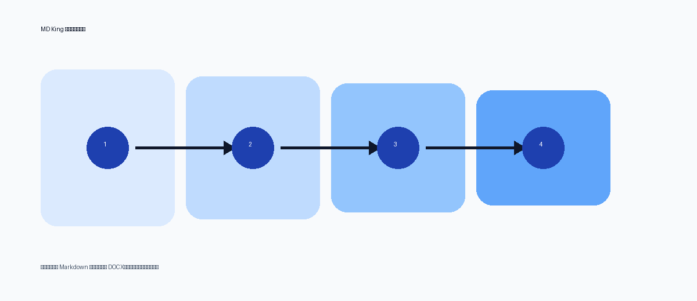

# MD King 默认模板综合转换测试

这是一份用于验证 **默认报告模板** 的综合 Markdown。它覆盖标题、正文、强调、链接、引用、列表、代码块、表格、图片、题注和分隔线等常用结构，目标是检查导出到 Word/WPS 后的实际样式是否稳定。

[项目链接示例](https://example.com) 与 `inlineCode()` 用于检查链接和行内代码样式。下面还有中文、English text、数字 12345 的混排效果。

## 1. 文档结构与正文样式

普通正文应该保持易读的字号、行距和段前段后间距。这里放一段稍长的文字，用来观察换行、段落间距、中文标点和英文单词在 Word 中的显示效果。用户实际导出的 AI 文档通常会包含说明性段落、分析段落和结论段落，因此正文样式是最核心的验证项。

### 1.1 文本强调

- **加粗文本**：用于关键结论和重要名词。
- *斜体文本*：用于轻量强调。
- `inlineCode()`：用于命令、函数名或配置项。
- ~~删除线文本~~：用于变更记录或废弃项。

> 这是一段引用块。引用块应该和正文有所区分，左侧竖线、背景色、文字颜色和段落间距都需要清晰但不能太夸张。
>
> 引用块第二段用于检查多段引用的间距是否正常。

## 2. 列表样式

### 2.1 无序列表

- 一级无序列表，检查项目符号和文本间距。
- 第二项内容比较长，用来测试换行后的对齐方式是否正确。换行后的文字最好能和第一行文字对齐，而不是跑到项目符号下面。
  - 二级无序列表，检查缩进层级。
  - 二级列表第二项。
    - 三级无序列表，检查更深层级的展示。
- 回到一级列表。

### 2.2 有序列表

1. 第一步：读取 Markdown。
2. 第二步：解析标题、列表、表格、图片等结构。
3. 第三步：套用默认报告模板并输出 DOCX。
   1. 子步骤 A：生成临时文件。
   2. 子步骤 B：调用 Pandoc。
4. 第四步：检查 Word/WPS 里的实际效果。

### 2.3 任务清单

- [x] 标题层级
- [x] 表格
- [x] 图片
- [ ] 页眉页脚与页码
- [ ] 目录和交叉引用

## 3. 代码块

下面是 Python 代码块，检查代码块背景、字体、缩进、语法高亮以及语言标识。

```python
def convert_markdown(input_path: str, output_path: str) -> None:
    """Convert Markdown into a styled Word document."""
    options = {
        "template": "default-report",
        "toc": True,
        "highlight": "tango",
    }
    print(f"Converting {input_path} -> {output_path}")
    return options
```

下面是 TypeScript 代码块：

```ts
type ConvertStatus = "idle" | "running" | "success" | "failed";

export function buildOutputName(source: string) {
  return source.replace(/\.md$/i, ".docx");
}
```

## 4. 表格样式

表格应检查表头、边框、斑马纹、单元格内边距、对齐方式和长文本换行。

| 模块 | 状态 | 验证重点 | 备注 |
| --- | :---: | --- | --- |
| 标题 | 通过 | H1/H2/H3 层级、字号、间距 | 标题间距不能过大 |
| 列表 | 待检查 | 有序、无序、多级列表缩进 | 长文本换行要对齐 |
| 图片 | 待检查 | 图片居中、宽度适配内容区 | 需要接近可用纸宽 |
| 代码块 | 待检查 | 字体、背景、颜色、语言 | 代码不要挤在一起 |
| 表格 | 待检查 | 边框、内边距、表头 | 单元格不要贴边 |

## 5. 图片与题注



图 1：Markdown 图片导出测试。图片应居中，并尽量适配去掉页边距后的内容宽度。

## 6. 分隔线与结论

---

### 结论

如果这份文档可以顺利导出，并且图片、表格、代码块、列表、引用块都能在 Word/WPS 中正确显示，就说明默认模板的基础转换链路基本可用。后续可以继续重点看：目录、页码、图片宽度、题注位置、代码块高亮和表格细节。
