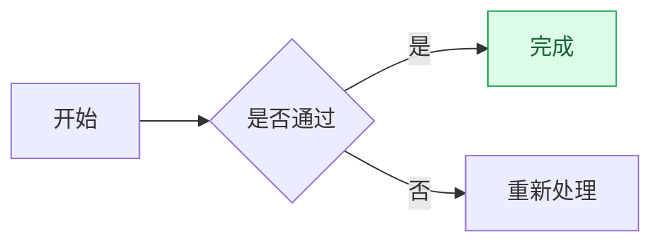
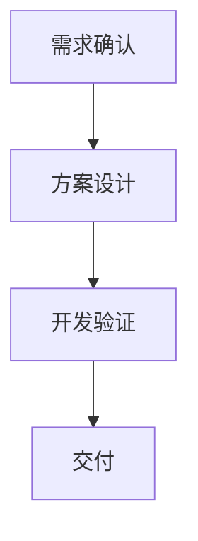

# Mermaid 转换回归

## 横向流程图

```mermaid
flowchart LR
    A[开始] --> B{是否通过}
    B -->|是| C[完成]
    B -->|否| D[重新处理]
    classDef success fill:#DCFCE7,stroke:#16A34A,color:#166534;
    class C success;
```

## 纵向流程图

```mermaid
flowchart TD
    A[需求确认] --> B[方案设计]
    B --> C[开发验证]
    C --> D[交付]
```
