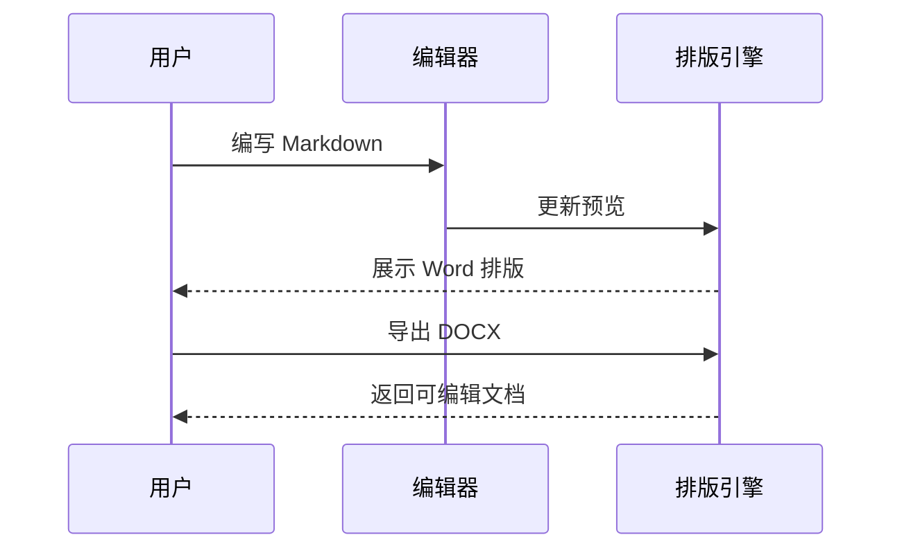

# Markdown 文档交付方案

本文以团队技术报告为例，展示 Markdown 编辑、Word 预览和样式配置。所有内容均为演示数据，可直接复制后修改。

## 文档目标

统一报告的标题、公式、表格和代码样式。编辑时查看排版，交付时生成可继续编辑的 Word 文档。

### 验收指标

| 检查项 | 目标 | 验证方式 |
| --- | --- | --- |
| 章节目录 | 标题层级清晰 | 右侧大纲跳转 |
| 数学公式 | 无红色错误源码 | 检查公式预览 |
| 交付格式 | DOCX 可编辑 | Word / WPS 打开 |

### 计算示例

单次请求的平均延迟为 $\bar{t}=120\,\mathrm{ms}$，并行度为 $n=8$。理论吞吐量估算为：

$$
Q = \frac{n}{\bar{t}} = \frac{8}{0.12} \approx 66.7\,\mathrm{s}^{-1}
$$

以上仅用于说明公式排版，不代表产品性能测试结果。

## 处理流程

### 文档生成时序



### 导出参数

```typescript
const report = {
  title: "Markdown 文档交付方案",
  template: "技术报告",
  output: "report.docx",
};
console.log(`准备导出：${report.title}`);
```

## 交付检查

1. 校对标题、公式和表格内容。
2. 在模板中心统一正文与标题样式。
3. 检查 Word 预览的页边距和分页。
4. 导出后用 Word 或 WPS 检查最终结果。

> 演示说明：浏览器用于展示真实前端界面；文件系统操作、Word 转换和自动安装更新需要 Windows 桌面版。
